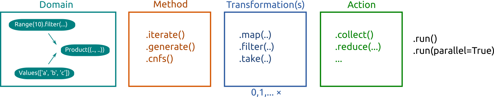

Pipeline
========

.. currentmodule:: haydi

This section contains a description of how to work with elements of domains.
The main message of this section is that there are three basic methods of
creating a stream of elements from a domain:

* ``iterate()`` -- stream of all elements in domain
* ``cnfs()`` -- stream of all canonical elements in domain
* ``generate()`` -- stream of random elements from domain

The rest of this section describes the whole machinery in more detail. If you
are interested in sequential computations only, and you want to handle the
stream manually, you can just directly use Python iterators as follows::

    >>> import haydi as hd
    >>> for x in hd.Subsets(hd.Range(10)).generate(5):  # print five random subsets
    >>>     print x

The purpose of the pipeline is to simplify some common operations and enable
transparent distributed computations.

Overview
--------

The whole pipeline is composed of the following elements:

* *Domain* -- a domain as described in the previous section
* *Method* -- how to take elements from the domain into the stream
* *Transformations* -- transformations of the stream
* *Action* -- final aggregation of results
* *Run* -- the actual invocation of the pipeline

Method
------

There are three methods how we can walk through a domain:
iterate, iterate through canonical forms and random generation.

Iterate
~~~~~~~

A pipeline that iterates through all elements is created by method
``iterate()``:

   >>> import haydi as hd
   >>> domain = hd.Range(2) * hd.Range(2)
   >>> domain.iterate()
   <Pipeline for Product: method=iterate action=Collect>

Calling ``iterate()`` on a domain creates a pipeline object. Moreover we can also see
that the default action is *Collect*. This action simply takes all elements and
put them into the list. More details about actions can be found :ref:`below <actions>`.

The pipeline is a lazy object and no elements are actually constructed. To run
the pipeline, we need to call ``run()`` method::

   >>> domain.iterate().run()
   [(0, 0), (0, 1), (1, 0), (1, 1)]

The ``iterate()`` method iterates through all elements in domain. It is
guaranteed that each element in the domain occurs in the stream in the same
number of occurrences as in the domain. The actual order of elements in the
stream is *not* guaranteed.

Canonical forms
~~~~~~~~~~~~~~~

Iterating over canonical elements is a little bit special, hence
there is a dedicated section about this topic: :doc:`cnfs`.

Random elements
~~~~~~~~~~~~~~~

A pipeline that generates random elements from a domain is created by method
``generate(count=None)``, where the optional parameter ``count`` specifies the
number of generated elements::

   >>> domain = hd.Range(2) * hd.Range(2)
   >>> domain.generate(5)
   [(0, 1), (0, 0), (1, 0), (0, 0), (1, 1)]

By default, all elements are generated with the same probability, however in
several places, it can be configured. See the API documentation for
:class:`Join`.

When the argument of ``generate`` is ``None``, then we obtain an infinite
pipeline of random instances. It usually makes sense in combination with a
filter and setting a limit after the filter.

For example, the following code generates 10 pairs whose sum is 11:

   >>> domain = hd.Range(10) * hd.Range(10)
   >>> domain.generate().filter(lambda x: x[0] + x[1] == 11).take(5).run()  # doctest: +SKIP
   [(3, 8), (5, 6), (9, 2), (3, 8), (6, 5)]

Transformation ``take(5)`` limits the pipeline for the first five elements. As
an exercise we left what happens when we put ``5`` as the argument for
``generate`` and remove the ``take``. TODO

Transformations
---------------

The current version offers three *pipeline transformations*:

* ``map(fn)`` -- maps the function ``fn`` on each element that goes through the
  pipeline
* ``filter(fn)`` -- filters elements in the pipeline according to the provided function
* ``take(count)`` -- takes only first ``count`` elements from pipeline

At the first sight, there is an overlap between transformations on domains and
in the pipeline. In fact, they have in many cases completely the same effect::

  >>> domain = hd.Range(5)
  >>> domain.map(lambda x: x * 10).iterate().run()  # Create a new domain and then iterate
  [0, 10, 20, 30, 40]
  >>> domain.iterate().map(lambda x: x * 10).run()  # Transformation in pipeline
  [0, 10, 20, 30, 40]

So why distinguish transformations in pipelines and on domains? The reason is
that in the pipeline, we know that process of the domain creation is completed
and have more freedom for additional features and optimizations. We already have a
stream of elements; therefore, we can introduce ``take`` transformation.
Moreover, the pipeline transformations do not have limitation in case of
:ref:`strict-domains` that are important in the usage of ``cnfs()``.

For performance reasons, pipeline transformations provide more opportunities
for efficient distributed computations. Therefore, Haydi prefers *map* and
*filter* transformations as pipeline transformations rather than domain
transformations. For this reason, Haydi automatically moves last
transformations on domains to the pipeline; therefore, the above example
actually creates the same pipeline (with one pipeline transformation)::

  >>> domain.map(lambda x: x * 10).iterate()
  <Pipeline for Range: method=iterate ts=[MapTransformation] action=Collect>
  >>> domain.iterate().map(lambda x: x * 10)
  <Pipeline for Range: method=iterate ts=[MapTransformation] action=Collect>

Of course 'inner' domain transformations cannot be moved. For example the
following code creates a pipeline without any transformation (the transformation
remains hidden inside the domain composition)::

  >>> domain = hd.Subsets(hd.Range(3).map(lambda x: x * x))
  >>> domain.iterate().run()
  [{}, {0}, {0, 1}, {0, 1, 4}, {0, 4}, {1}, {1, 4}, {4}]
  >>> domain.iterate()
  <Pipeline for Subsets: method=iterate action=Collect>

.. _actions:

Actions
-------

*Action* is a terminal operation on a stream of elements. There are the
following list of actions; more details can be found
in API documentation of :class:`Pipeline`.

Collect
~~~~~~~

Action *collect* creates a list from the stream::

  >>> hd.Range(5).iterate().collect().run()
  [0, 1, 2, 3, 4]

The *collect* is the default action; therefore, the above code is equivalent to:

  >>> hd.Range(5).iterate().run()
  [0, 1, 2, 3, 4]

First
~~~~~

Action *first* takes the first element from the stream. If the stream is
empty it returns the provided argument (the default is ``None``).

    >>> hd.Range(5).iterate().first().run()
    0
    >>> hd.Range(5).filter(lambda x: x > 10).first().run()  # doctest: +SKIP
    None
    >>> hd.Range(5).filter(lambda x: x > 10).first("no value").run()
    'no value'

Reduce
~~~~~~

Action *reduce* applies a binary operation on elements of the stream::

  >>> hd.Range(10).reduce(lambda x, y: x + y).run()
  45

You can optionally specify an initial value::

  >>> hd.Range(10).reduce(lambda x, y: x + y, -3).run()
  42

It is assumed by default that the operation is associative,
if that is not true, you have to explicitly specify it::

  >>> hd.Range(10).reduce(lambda x, y: x - y, 100, associative=False).run()
  55

Max
~~~

Action *max* gathers maximal elements in the stream, optionally it can take a
function that extracts a value from the element that is used for comparison.
The second optional argument specifies the limit of maximal elements.
No more than the limit number of elements is returned, the rest of maximal elements is thrown away.
Which maximal elements are thrown away and what are returned is not specified.
If the value of the argument is ``None`` (default) then all maximal elements are gathered::

  >>> domain = hd.Range(5) * hd.Range(5)

  >>> domain.max().run()
  [(4, 4)]

  >>> domain.max(lambda x: x[0]).run()  # Maximum in the first element in the pair
  [(4, 0), (4, 1), (4, 2), (4, 3), (4, 4)]

  >>> domain.max(lambda x: x[0], 2).run()  # At most two maximal elements
  [(4, 0), (4, 1)]

Groups
~~~~~~

Action *groups* divides elements in the stream into groups according to a key.
The method takes a function that is applied on each element to obtain the key.

  >>> hd.Range(10).groups(lambda x: x % 3).run()
  {0: [0, 3, 6, 9], 1: [1, 4, 7], 2: [2, 5, 8]}

Optionally it takes an integer argument that limits the size of groups. No
more than the limit number of elements is returned for each group. What elements
in the group are thrown away and what are returned is not specified.

  >>> hd.Range(10).groups(lambda x: x % 3, 2).run()
  {0: [0, 3], 1: [1, 4], 2: [2, 5]}

Groups_counts
~~~~~~~~~~~~~

SIMPLE TODO

Run
---

The ``run(ctx=None, timeout=None, otf_trace=False)`` method invokes the
pipeline. By default it creates a executes a sequential computation without any
time limit. This can be changed by parameters.

The ``ctx`` parameter defines a context that is used to run the computation on
the pipeline. Using this parameter you can run a parallelized
:doc:`distributed computation <distributed>`.
``timeout`` expects an ``int`` (number of seconds) or a ``timedelta`` object.
This controls the maximum permitted time of the computation. If the allocated
time runs out, the computation will stop and return a partial result.

Shortcuts
---------

To make the code more concise, there are following defaults defined for the
pipeline:

* Method: ``iterate``
* Transformations: None
* Action: ``collect``
* Run: ``run()``

Therefore, we can call ``.run()`` directly on domain and obtain the same results
as using ``.iterate().collect().run()``. It automatically creates a default
pipeline.

In the same manner we can also directly call actions on domain. It creates a
pipeline with ``iterate()``.

Examples::

   >>> hd.Range(5).run()  # .iterate().collect() is used
   [0, 1, 2, 3, 4]

   >>> hd.Range(5).max().run()  # .iterate() is used
   [4]

When we create an iterator from a domain or a pipeline, we obtain an iterator to
the result of pipeline where missing elements are filled by defaults::

   >>> list(hd.Range(5))
   [0, 1, 2, 3, 4]

   >>> list(hd.Range(5).map(lambda x: x * x))
   [0, 1, 4, 9, 16]

   >>> list(hd.Range(5).max())
   [4]

Immutability of pipelines
-------------------------

Pipelines are immutable objects as same domains; therefore calling methods on
them actually creates new objects. It is thus safe to reuse them::

  >>> pipeline = hd.Range(5).iterate()
  >>> pipeline.take(2).run()
  [0, 1]
  >>> pipeline.max().run()
  [4]

